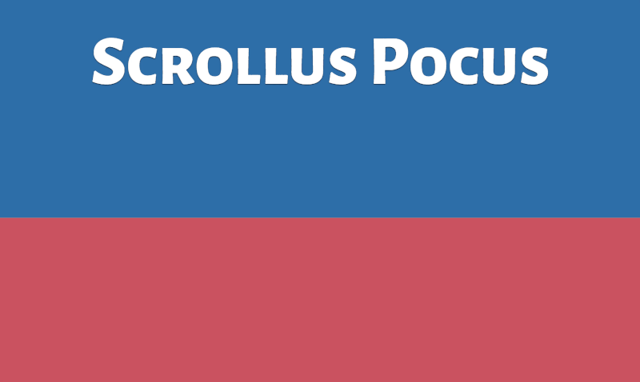

# Scrollus Pocus

Scrollus Pocus is a simple, magical effect which can be applied to text to enable different text colour between different containers. See below for an example:



The effect is a Javascript class which is passed parameters to its instantiation, as per the below section.

## Usage

Include the **Scrollus Pocus** script in your application:

```javascript
<script src="scrolluspocus.js"></script>
```

Pick which element you would like to have the effect (usually website/app logo or intro text). Create an array of objects which tell Scrollus Pocus which elements to use as containers for the target element, and signify which colour you'd like the target element to have in that container element:

```javascript
<script>
var panes = [
  {
    element: '.container1',
    color: '#ffffff'
  },
  {
    element: '.container2',
    color: '#286dab'
  },
  {
    element: '.container3',
    color: '#cd5360'
  },
  {
    element: '.container4',
    color: '#b37d4e'
  }
];
</script>
```

Call the ScrollusPocus class and pass in the target element class, and the panes object.

```javascript
var scrolly = new ScrollusPocus('.logo', panes);
```


## Some considerations

* The target element must have a fixed position
* The effect will only work with text nodes currently (SVG and image support coming soon)
* Older browsers (pre IE10) are not supported
